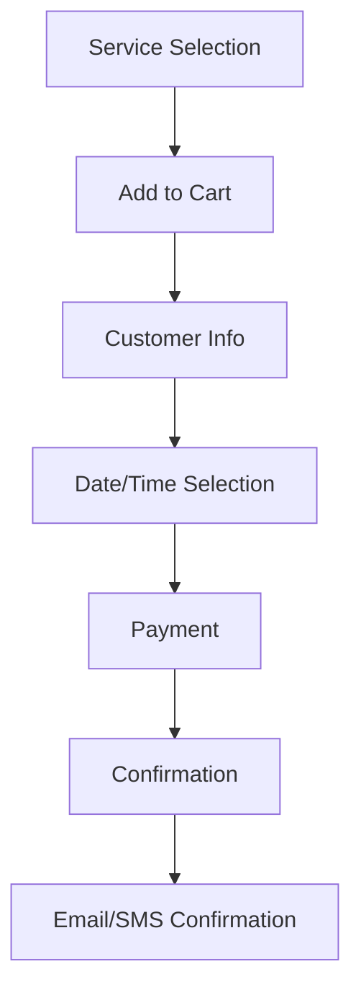

# Detailed Technical Plan: Self-Sufficient Booking and Sales Platform Integration

## Executive Summary

This plan outlines the integration of a comprehensive booking and sales platform into the existing Next.js application for an auto-detailing business. The implementation focuses on Phase 1 ("Automate the Cash Register") to digitize service menus, enable automated bookings, and facilitate 24/7 sales without manual intervention.

## Current State Analysis

- **Frontend**: Next.js App Router with TailwindCSS and shadcn/ui components
- **Services**: Static data in `lib/services-data.ts` with 15 service categories and clusters
- **Backend**: None - no Convex, Clerk, or database integration yet
- **Booking**: Manual contact form only (`/contact`)
- **Architecture**: Clean separation with reusable UI components

## Business Requirements Mapping

### Phase 1: Automate the Cash Register
- **Digitize Service Menus**: Convert static service data to dynamic, bookable services with pricing
- **Automated Bookings**: 24/7 booking system with calendar integration
- **Payment Processing**: Secure deposits and full payments
- **Self-Sufficient Sales**: No manual intervention required for standard bookings

### Key Features to Implement
- Service catalog with add-to-cart functionality
- Real-time booking calendar
- Payment processing with Square
- Automated confirmations and reminders
- Multi-organization support via Clerk
- Admin dashboard for service management

## Technical Architecture

### Backend Setup
- **Convex**: Real-time database and backend functions
- **Clerk**: Authentication and multi-tenant organization management
- **External APIs**:
  - Calendly: Booking scheduling
  - Square: Payment processing
  - Urable: Advanced scheduling features

### Database Schema (Convex)

```typescript
// Organizations (managed by Clerk)
organizations: {
  _id: Id<"organizations">,
  clerkId: string,
  name: string,
  slug: string,
  settings: {
    businessHours: BusinessHours,
    bookingSettings: BookingSettings,
    paymentSettings: PaymentSettings
  }
}

// Services (migrated from static data)
services: {
  _id: Id<"services">,
  organizationId: Id<"organizations">,
  slug: string,
  title: string,
  description: string,
  basePrice: number,
  duration: number, // minutes
  category: string,
  isActive: boolean,
  packages: ServicePackage[]
}

// Bookings
bookings: {
  _id: Id<"bookings">,
  organizationId: Id<"organizations">,
  customerId: Id<"customers">,
  services: BookingService[],
  scheduledAt: Date,
  status: "pending" | "confirmed" | "in_progress" | "completed" | "cancelled",
  totalAmount: number,
  depositAmount: number,
  paymentStatus: "unpaid" | "deposit_paid" | "paid" | "refunded",
  notes?: string
}

// Customers
customers: {
  _id: Id<"customers">,
  organizationId: Id<"organizations">,
  clerkId?: string, // for authenticated users
  name: string,
  email: string,
  phone: string,
  vehicleInfo: VehicleInfo
}
```

## Implementation Phases

### Phase 1.1: Foundation Setup (Week 1)

#### 1. Backend Infrastructure Setup
- Install and configure Convex
- Set up Clerk authentication with organization support
- Create initial database schema
- Configure environment variables

#### 2. Service Data Migration
- Migrate static service data to Convex database
- Add pricing and duration fields
- Create service packages and add-ons

#### 3. Authentication & Organization Setup
- Implement Clerk middleware for org-scoped routes
- Create organization onboarding flow
- Set up role-based access (admin, staff)

### Phase 1.2: Core Booking System (Week 2-3)

#### 4. Service Catalog Digitization
- Create dynamic service display components
- Implement add-to-cart functionality
- Add service customization options

#### 5. Booking Flow Implementation
- Build booking calendar interface
- Implement time slot selection
- Create customer information collection

#### 6. Payment Integration
- Integrate Square payment processing
- Implement deposit requirements
- Add payment status tracking

### Phase 1.3: Automation & External Integrations (Week 4)

#### 7. Calendly Integration
- Sync availability with Calendly
- Automate booking confirmations
- Handle rescheduling and cancellations

#### 8. Urable Integration (Optional)
- Advanced scheduling features
- Resource management for multiple technicians
- Automated reminders and follow-ups

#### 9. Notification System
- Email confirmations via Resend
- SMS notifications for booking updates
- Automated reminders

### Phase 1.4: Admin Dashboard & Optimization (Week 5)

#### 10. Admin Interface
- Service management dashboard
- Booking overview and management
- Customer management
- Reporting and analytics

#### 11. Performance Optimization
- Implement caching strategies
- Optimize database queries
- Add loading states and error handling

## API Integrations Detail

### Calendly Integration
```typescript
// API Routes
POST /api/calendar/webhooks - Handle Calendly webhooks
GET /api/calendar/availability - Get available time slots
POST /api/calendar/book - Create booking via Calendly
```

### Square Payment Processing
```typescript
// API Routes
POST /api/payments/create - Create payment intent
POST /api/payments/webhooks - Handle payment webhooks
GET /api/payments/status - Check payment status
```

### Convex Functions
```typescript
// Public functions
api.bookings.createBooking
api.services.getServices
api.customers.createCustomer

// Internal functions
internal.bookings.processPayment
internal.calendar.syncAvailability
internal.notifications.sendConfirmation
```

## UI/UX Changes

### New Pages & Components
- `/book` - Main booking flow
- `/dashboard` - Admin dashboard
- `/services/[slug]/book` - Service-specific booking
- `components/booking/` - Booking flow components
- `components/admin/` - Admin interface components

### Enhanced Existing Pages
- `/services` - Add "Book Now" CTAs
- Service detail pages - Include pricing and booking options
- Header - Add booking/cart indicators

### Booking Flow User Journey


## Testing Strategy

### Unit Tests
- Convex function validation
- Component rendering
- Form validation logic

### Integration Tests
- Booking flow end-to-end
- Payment processing
- External API integrations

### E2E Tests (Playwright)
- Complete booking journey
- Admin dashboard functionality
- Mobile responsiveness

## Deployment & Monitoring

### Environment Setup
- Development: Local Convex dev server
- Staging: Convex staging environment
- Production: Convex production with monitoring

### Monitoring
- Convex dashboard for performance
- Error tracking with Sentry
- Payment webhook monitoring
- Booking conversion analytics

## Security Considerations

- Clerk organization-scoped data isolation
- Secure payment processing via Square
- Input validation on all forms
- Rate limiting on booking endpoints
- Audit logging for admin actions

## Future Phase Extensions

### Phase 2: Customer Experience Enhancement
- Customer portal for booking management
- Loyalty program integration
- Automated follow-up surveys

### Phase 3: Advanced Features
- Multi-location support
- Technician scheduling optimization
- Advanced reporting and analytics

### Phase 4: Marketplace Expansion
- Third-party service provider integration
- Franchise management
- API for external integrations

## Success Metrics

- Booking conversion rate > 70%
- Average booking value increase
- Manual intervention reduction > 80%
- Customer satisfaction score > 4.5/5
- Platform uptime > 99.9%

## Risk Mitigation

- Gradual rollout with feature flags
- Comprehensive testing before production
- Backup payment processing options
- Clear rollback procedures
- Regular data backups

This plan provides a comprehensive roadmap for transforming the static service display into a fully automated booking and sales platform, enabling 24/7 operations with minimal manual intervention.